<p align="center">
  
</p>

<p align="center">
  <b>Building practical apps, clean UI, and fun developer experiences.</b>
</p>

<p align="center">
  <a href="https://github.com/Aleksandros2">GitHub</a> |
  <a href="https://github.com/Aleksandros2?tab=repositories">Projects</a>
</p>

<p align="center">
  
</p>

---

## About

- Student developer from Switzerland
- Interested in practical apps, automation, and clean UI
- Improving portfolio and GitHub projects continuously

## Tech Stack

`Python` `C#` `HTML` `CSS` `JavaScript` `SQL`

## Repository Purpose

This repository is a profile project focused on:

- concise visual branding (`assets/name-shift.svg`)
- an automated contribution visualization (`assets/arcade-contrib.svg`)
- a maintainable and reproducible generation workflow

## Contribution Animation Pipeline

- Generator script: `scripts/generate_arcade_contrib.py`
- Workflow: `.github/workflows/arcade-contributions.yml`
- Main output: `assets/arcade-contrib.svg`

The workflow runs on schedule and can also be triggered manually.  
If GitHub API data is temporarily unavailable, the script falls back to a deterministic mock calendar so the visual remains stable.

## Run Locally

From the repository root:

```bash
python scripts/generate_arcade_contrib.py
```

Optional environment variables:

- `PROFILE_USERNAME` (default: inferred from repository owner)
- `GITHUB_TOKEN` (if set, fetches live contribution data via GitHub GraphQL API)

Without `GITHUB_TOKEN`, the script still generates a local preview using mock data.
