  

  <b>Building practical apps, clean UI, and fun developer experiences.</b>

  <a href="https://github.com/Aleksandros2">GitHub</a> |
  <a href="https://nikolicaleksandar.netlify.app">Portfolio Website</a> |
  <a href="https://github.com/Aleksandros2?tab=repositories">Projects</a>

  

---

## About me

- Student developer from Switzerland
- Interested in practical apps, automation, and clean UI
- Improving portfolio and GitHub projects continuously

## Tech stack

`Python` `C#` `HTML` `CSS` `JavaScript` `SQL`

## How this works

- The SVG is generated by `scripts/generate_pacman_contrib.py`
- GitHub Actions runs daily and updates `assets/pacman-contrib.svg`
- Workflow file: `.github/workflows/pacman-contributions.yml`
