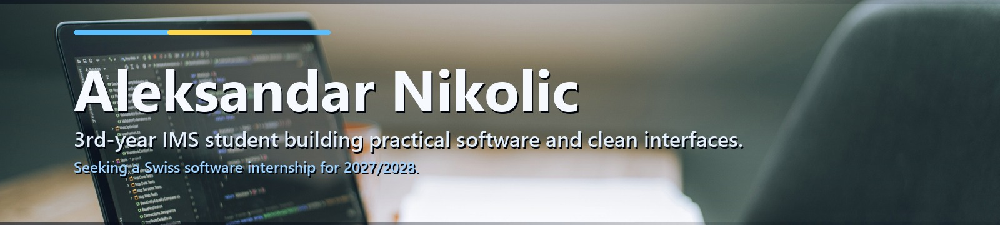

  
   
   
  <a href="https://aleksandar-nikolic.netlify.app">Portfolio</a> |
  <a href="https://github.com/AleksZyro?tab=repositories">Repositories</a>
   
   
  
   
   
  

---

## About me

- IMS student in Switzerland, entering my 3rd year and focused on software development
- Looking for a software internship in Switzerland for the 2027/2028 practical year
- I like building small tools, school projects, and experiments that feel more like real products than class exercises
- Clean interfaces matter to me because a project should be easy to understand before someone reads the code

## Selected work

| Type | Project | What it shows |
| --- | --- | --- |
| Personal product | [FolioLint](https://github.com/AleksZyro/FolioLint) | Python CLI for checking whether repositories are ready to present publicly |
| Personal frontend | [Portfolio Website](https://github.com/AleksZyro/Portfolio-Website) | Personal website, visual polish, project presentation, and deployment workflow |
| School project | [LB259](https://github.com/AleksZyro/LB259) | IMS coursework with notebooks, documentation, and data-oriented exercises |
| Learning lab | [PathLab](https://github.com/AleksZyro/PathLab) | Interactive pathfinding visualizer for BFS, DFS, Dijkstra, and A* |
| Learning lab | [SortLab](https://github.com/AleksZyro/SortLab) | Sorting algorithm visualizer with operation counts and custom inputs |
| Experiment | [BESP2074](https://github.com/AleksZyro/BESP2074) | Interactive simulation/dashboard work with scenarios and long-term forecasts |
| Game/modding | [UMR Mod](https://github.com/AleksZyro/UMR-Useless-mobs-reworked-Mod) | Minecraft modding experiment in Java |
| Open source practice | [Forks and PR work](https://github.com/AleksZyro?tab=repositories&q=&type=fork) | Practice with real repositories, review feedback, and external contribution workflows |

## Tech stack

This overview combines technologies used in personal projects, team projects, and IMS coursework; my experience level varies by tool.

| Area | Tools |
| --- | --- |
| Languages | `Python` `C#` `JavaScript` |
| Frontend | `HTML` `CSS` `JavaScript` |
| Data | `SQL` |

## Current focus

- **Preparing:** applications and portfolio material for a 2027/2028 Swiss internship
- **Building:** practical tools with `Python`, `C#`, and `JavaScript`
- **Learning:** cleaner frontend structure, interactive UI patterns, and maintainable project structure

## Profile build

- Header uses a real office/code photo adapted into `assets/profile-banner.jpg`
- The Pac-Man SVG is generated by `scripts/generate_pacman_contrib.py`
- GitHub Actions checks real GitHub contribution data several times per day and republishes the Pac-Man SVG only when the file really changes
- Workflow file: `.github/workflows/pacman-contributions.yml`
